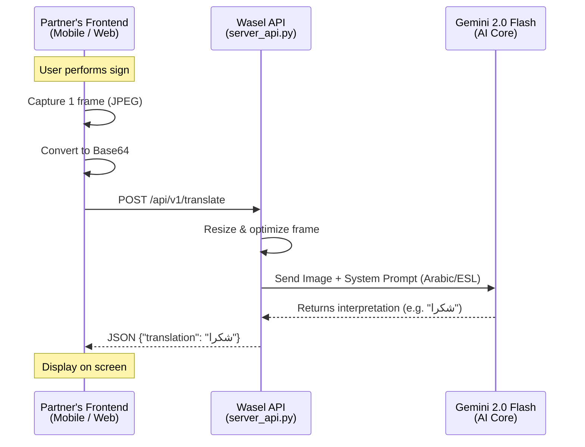

# 🚀 Wasel v4 Pro — B2B API Integration Guide

## 1. Overview
This guide is for external partners integrating **Wasel v4 Pro** as a backend AI translation engine.
The solution is provided as a **Headless REST API** that accepts video frames (images) and returns the translated sign language meaning in real-time.

---

## 2. How the System Works



### Key Concepts:
1. **Stateless Processing**: The API analyzes frames individually. No session management is needed.
2. **Frequency**: The partner application should capture a frame from the device camera and send a POST request every **1.5 to 2.0 seconds** (recommended).
3. **No External Models**: There is no need to load YOLO or MediaPipe on the client side. The raw RGB/JPEG image is enough.

---

## 3. Customizing the AI (Arabic & Egyptian Sign Language)

The core intelligence comes from a highly specific "System Prompt" sent alongside the image.
Because the engine is powered by Generative AI (Gemini), **changing the target language or dialect is as simple as changing the prompt text.**

In `wasel_api.py`, locate the `PROMPT_ARABIC_ESL` variable.

### Current Prompt (Arabic - Egyptian Sign Language):
```python
PROMPT_ARABIC_ESL = """
أنت خبير ومترجم للغة الإشارة المصرية (Egyptian Sign Language - ESL).
انظر إلى هذه الصورة لليد والجسم. هل يقوم الشخص بعمل إشارة معينة بلغة الإشارة؟
إذا نعم: أجب فقط بمعنى الإشارة باللغة 'العربية' في كلمة واحدة أو كلمتين كحد أقصى (مثال: شكرا، نعم، لا، مساعدة، سلام).
إذا لم تكن هناك إشارة واضحة: أجب بالضبط بـ: ...
لا تكتب أي شرح، فقط الكلمة.
"""
```

### How to Modify:
- **Change to Gulf Sign Language**: Replace `الإشارة المصرية` with `لغة الإشارة الخليجية`.
- **Change to English (ASL)**: Replace the entire text with English instructions targeted at ASL.
- **Tone Adjustments**: Add rules like `استخدم اللغة الفصحى فقط` (Use standard Arabic only) or `استخدم اللهجة العامية` (Use colloquial dialect).

---

## 4. API Documentation

### 🟢 Endpoint: Translate Frame
`POST /api/v1/translate`

**Request Headers:**
```
Content-Type: application/json
```

**Request Body:**
```json
{
  "image_base64": "/9j/4AAQSkZJRgABAQEASABIAAD..." // raw base64 or data URI
}
```

**Success Response (200 OK):**
```json
{
  "translation": "شكرا",
  "processing_time_ms": 780,
  "language": "ar",
  "dialect": "egyptian_sign_language"
}
```

**No Sign Detected Response:**
```json
{
  "translation": "...",
  "processing_time_ms": 650,
  "language": "ar",
  "dialect": "egyptian_sign_language"
}
```

---

### 🟢 Endpoint: Health Check
`GET /api/v1/health`

**Success Response (200 OK):**
```json
{
  "status": "online",
  "model": "gemini-2.0-flash",
  "engine": "wasel-v4-headless",
  "api_version": "1.0"
}
```

---

## 5. Performance Tips for Integrators

1. **Resolution vs Latency**: 
   - Highly detailed frames slow down transmission and inference. 
   - **Recommendation**: Resize images to `512x512` or `640x480` on the client side *before* converting to Base64.
2. **JPEG Compression**:
   - Send JPEGs compressed at ~60-70% quality. Wait times drop significantly with smaller payloads.
3. **Throttling**:
   - Do not send 30 frames per second. The human processing speed for sign language is roughly 0.5 - 1 sign per second. Polling the API every `1500ms` to `2000ms` saves bandwidth and server costs.
